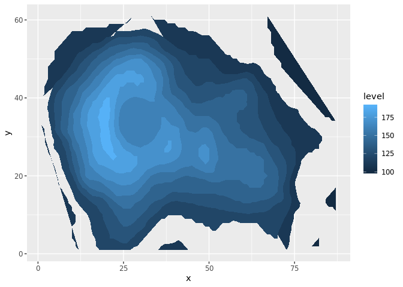
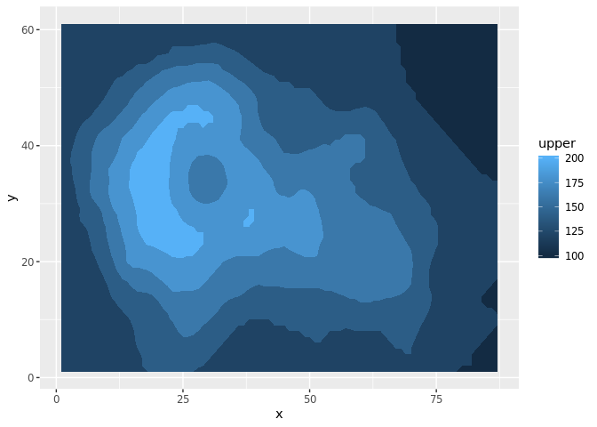

<!-- README.md is generated from README.Rmd. Please edit that file -->
contourPolys
============

The goal of contourPolys is to create polygons via contourLines.

Example
-------

By hacking `filled.contour` we can get all the fragments out, reproject their coordinates and plot for a nice effect.

``` r
# z <- volcano
# 
# x <- 10*1:nrow(z)
# y <- 10*1:ncol(z)
# d <- raster(list(x = x, y = y, z = z))
# 
# levels <- pretty(range(volcano))

library(raadtools)
#> Loading required package: raster
#> Loading required package: sp
d <- aggregate(readtopo("etopo2", xylim = extent(120, 150, -45, -30))[[1]], fact = 4)
x <- yFromRow(d)
y <- xFromCol(d)
z <- as.matrix(d)
levels <- pretty(range(z), n = 7)
p <- contourPolys::fcontour(x, y, z, levels)
m <- cbind(x = unlist(p[[1]]), 
           y = unlist(p[[2]]), 
           lower = rep(unlist(p[[3]]), lengths(p[[1]])), 
           upper = rep(unlist(p[[4]]), lengths(p[[1]])), 
           g = rep(seq_along(p[[1]]), lengths(p[[1]]))) 

gd <- as.data.frame(m)
gd[c("x", "y")] <- proj4::ptransform(as.matrix(gd[c("y", "x")]) * pi/180, 
                                     "+init=epsg:4326", 
                                     "+proj=lcc +lon_0=147 +lat_0=-42 +lat_1=-30 +lat_2=-60")
library(ggplot2)
#> 
#> Attaching package: 'ggplot2'
#> The following object is masked from 'package:raster':
#> 
#>     calc
ggplot(gd, aes(x, y, group = g, fill  = upper)) + geom_polygon()
```



This seems to work, but the nesting is v hard to get right.

``` r
library(raster)
library(dplyr)
#> 
#> Attaching package: 'dplyr'
#> The following object is masked from 'package:ggplot2':
#> 
#>     vars
#> The following objects are masked from 'package:raster':
#> 
#>     intersect, select, union
#> The following objects are masked from 'package:stats':
#> 
#>     filter, lag
#> The following objects are masked from 'package:base':
#> 
#>     intersect, setdiff, setequal, union
p2seg <- function(x) cbind(head(seq_len(nrow(x)), -1), 
                           tail(seq_len(nrow(x)), -1))
sf_explode <- function(x) {
  d <- sf::st_coordinates(x) %>% 
    tibble::as_tibble()
  Ls <- grep("^L", names(d))
  paster <- function(...) paste(..., sep = "-")
  dl <- d[-Ls] %>% mutate(path = do.call(paster, d[Ls])) %>% 
    split(.$path) 
  ll <- purrr::map(dl, ~lapply(split(t(p2seg(.x)), rep(seq_len(nrow(.x)-1), each = 2L)), 
                               function(idx) sf::st_linestring(as.matrix(.x[idx, c("X", "Y")])))) 
  sf::st_sfc(unlist(ll, recursive = FALSE))
}
#' Contour polygons
#'
#' @param x Raster
#' @param ... arguments passed to `contourLines`
#'
#' @return sf polygons
#' @export
#'
#' @examples
contour_poly <- function(x, levels = NULL, ..., nlevels = 10) {
  minmax <- c(raster::cellStats(x, min), raster::cellStats(x, max))
  if (is.null(levels)) levels <- seq(minmax[1] - 1, minmax[2], length = nlevels)
  ex <- raster::extend(x, 1L, value = minmax[1] - 1)
  cl <- rasterToContour(x, ...)
}

r <- extend(raster(volcano), 1, value = min(volcano)- 1)
cl <- rasterToContour(r, levels = seq(min(volcano) - 0.5, max(volcano) - 10, by = 20))
x <- sf_explode(sf::st_as_sf(cl))


library(sf)
#> Linking to GEOS 3.6.2, GDAL 2.2.4, proj.4 4.9.3
p <- st_polygonize(st_union(x))
a <- st_cast(p)
st_overlaps(a)
#> Sparse geometry binary predicate list of length 6, where the predicate was `overlaps'
#>  1: (empty)
#>  2: (empty)
#>  3: (empty)
#>  4: (empty)
#>  5: (empty)
#>  6: (empty)
plot(a, col = viridis::viridis(length(a)))
```



``` r


library(anglr)
#> Warning in rgl.init(initValue, onlyNULL): RGL: unable to open X11 display
#> Warning: 'rgl_init' failed, running with rgl.useNULL = TRUE
```
