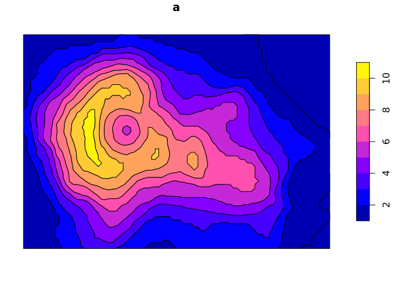

<!-- README.md is generated from README.Rmd. Please edit that file -->

# contourPolys

The goal of contourPolys is to create polygons via contourLines.

Currently this is just me experimenting with the problem and keeping
notes.

## Example

By hacking `filled.contour` we can get all the fragments out, and plot
properly with ggplot2.

The *very* primitive `fcontour` function will provide the equivalent of
the data set produced and plotted by filled.contour.

First, try to use `stat_contour`, it doesn’t work because `contourLines`
is not producing closed regions, and worse the polygon drawing is not
respecting holes that are filled by other smaller polygons.

``` r
## from https://twitter.com/BrodieGaslam/status/988601419270971392
library(reshape2)
v <- volcano
vdat <- melt(v)
names(vdat) <- c("x", "y", "z")
library(ggplot2)
ggplot(vdat, aes(x, y, z = z)) + 
  stat_contour(geom = "polygon",  aes(fill = ..level..))
```

<!-- -->

``` r


cl <- contourLines(volcano)
image(volcano, col = NA); purrr::walk(cl, polygon)
```

<!-- -->

One way to fix that is to *seal* the contour lines at the edges of the
grid, but it’s not easy to do. (The contouring is awesome in R, but the
coordinates don’t exactly go to the edges, which is the part I couldn’t
see an easy fix for).

A cheat’s way, is to use a version of `filled.contour` and save all the
fragments explicitly, and then plot as a set of tiny polygons.

``` r
z <- as.matrix(volcano)
y <- seq_len(ncol(z))
x <- seq_len(nrow(z))

levels <- pretty(range(z), n = 7)
p <- contourPolys::fcontour(x, y, z, levels)
m <- cbind(x = unlist(p[[1]]), 
           y = unlist(p[[2]]), 
           lower = rep(unlist(p[[3]]), lengths(p[[1]])), 
           upper = rep(unlist(p[[4]]), lengths(p[[1]])), 
           g = rep(seq_along(p[[1]]), lengths(p[[1]]))) 

gd <- as.data.frame(m)

library(ggplot2)
system.time({
print(ggplot(gd, aes(x, y, group = g, fill  = upper)) + geom_polygon())
})
```

<!-- -->

    #>    user  system elapsed 
    #>   0.344   0.024   0.369

Gggplot2 does plot many tiny polygons reasonably efficiently, because
`grid::grid.polygon` is vectorized for aesthetics and for holes - but at
some point it just won’t scale for very many pixels. Ultimately we will
want the regions as bounded areas.

We can coalesce these into efficient sf polygons, this is not done in an
efficient way but there are improvements that could be made.

  - return a different organization of the fragments
  - possibly, convert to edge-form, and simply remove any internal
    edges, then trace the remnants around in polygons (but that still
    needs to re-nest holes which is a hassle)
  - build per level in C, rather than return all the fragments to R as a
    set, so the tighter the levels the smaller the overall footprint at
    any time
  - some better marching squares proper thing …

(This does work, try it at home …)

``` r
z <- as.matrix(volcano)
y <- seq_len(ncol(z))
x <- seq_len(nrow(z))

levels <- pretty(range(z), n =10)
p <- contourPolys::fcontour(x, y, z, levels)
m <- cbind(x = unlist(p[[1]]), 
           y = unlist(p[[2]]), 
           lower = rep(unlist(p[[3]]), lengths(p[[1]])), 
           upper = rep(unlist(p[[4]]), lengths(p[[1]])), 
           g = rep(seq_along(p[[1]]), lengths(p[[1]]))) 

r1 <- function(x) {
                   nr <- length(x)/2; 
structure(list(matrix(x, ncol = 2)[c(seq_len(nr), 1), ]), 
                             class = c("XY", "POLYGON", "sfg"))
}
library(sf)
#> Linking to GEOS 3.6.2, GDAL 2.2.3, PROJ 4.9.3
xx <- lapply(split(m[, 1:2], rep(m[, 5], 2)), r1)
## drop bad ones
uu <- unlist(lapply(xx, st_is_valid))

x <- lapply(split(xx[uu], m[!duplicated(m[,5]), 3][uu]), 
            sf::st_geometrycollection)


x <- st_sfc(x)
y <- st_sf(geometry = x, a = seq_along(x))
plot(st_union(y, by_feature = TRUE))
```

<!-- -->

But, this way has other advantages because with all the fragments the
coordinates can be reprojected in a way that various R image plotters
cannot do. (R needs some intermediate between array structures and
polygons, so that shared vertices stayed shared (indexed) until needed,
and expansion is progressively done while plotting/building areas, or we
drop internal edges cleverly and trace around remaining boundaries. )

``` r
# z <- volcano
# 
# x <- 10*1:nrow(z)
# y <- 10*1:ncol(z)
# d <- raster(list(x = x, y = y, z = z))
# 
# levels <- pretty(range(volcano))

library(raadtools)
#> Loading required package: raster
#> Loading required package: sp
#> global option 'raadfiles.data.roots' set:
#> '/rdsi/PUBLIC/raad/data'
#> Uploading raad file cache as at 2018-09-27 02:56:48 (462318 files listed)
d <- readtopo("etopo2", xylim = extent(120, 150, -45, -30))[[1]]
x <- yFromRow(d)
y <- xFromCol(d)
z <- as.matrix(d)
levels <- pretty(range(z), n = 7)
p <- contourPolys::fcontour(x, y, z, levels)
m <- cbind(x = unlist(p[[1]]), 
           y = unlist(p[[2]]), 
           lower = rep(unlist(p[[3]]), lengths(p[[1]])), 
           upper = rep(unlist(p[[4]]), lengths(p[[1]])), 
           g = rep(seq_along(p[[1]]), lengths(p[[1]]))) 

gd <- as.data.frame(m)
gd[c("x", "y")] <- proj4::ptransform(as.matrix(gd[c("y", "x")]) * pi/180, 
                                     "+init=epsg:4326", 
                                     "+proj=lcc +lon_0=147 +lat_0=-42 +lat_1=-30 +lat_2=-60")
library(ggplot2)
system.time({
print(ggplot(gd, aes(x, y, group = g, fill  = upper)) + geom_polygon())
})
```

<!-- -->

    #>    user  system elapsed 
    #>  10.259   0.712  10.971
    
    ## timing is okayish  
    system.time({
    library(grid)
    grid.newpage()
    cols <- viridis::viridis(length(levels))[scales::rescale(unlist(lapply(split(gd$lower, gd$g), "[", 1)), to = c(1, length(levels)))]
    plot(range(gd$x), range(gd$y))
    vp <- gridBase::baseViewports()
    grid::pushViewport(vp$inner, vp$figure, vp$plot)
    grid::grid.polygon(gd$x, gd$y,
                       gd$g,
                       gp = grid::gpar(fill = cols, col = NA),
                       default.units = "native")
    grid::popViewport()
    })

<!-- -->

    #>    user  system elapsed 
    #>   8.385   0.160   8.546

## Constructing proper polygons

Can we coalesce by detecting boundaries?

We need

  - find unique coordinates, and map UID to instances
  - find unique segments within region, segments identical despite order
  - group\_by region, segment and remove any segments that occur *an
    even number of times per region*
  - join all remaining segments, and coerce to polygon

Almost works, removing repeated segments certainly works - but still we
have to re-nest the rings which is hard.

``` r
library(dplyr)
#> 
#> Attaching package: 'dplyr'
#> The following objects are masked from 'package:raster':
#> 
#>     intersect, select, union
#> The following objects are masked from 'package:stats':
#> 
#>     filter, lag
#> The following objects are masked from 'package:base':
#> 
#>     intersect, setdiff, setequal, union
# 1. choose a region
# 2. find all rings (remove even-repeated segments)
# 3. calculate all fragment centroids
# 4. do pip for all centroids in all region rings
# 5. apply even-odd rule

z <- as.matrix(volcano)
y <- seq_len(ncol(z))
x <- seq_len(nrow(z))
levels <- pretty(range(z), n = 7)
p <- contourPolys::fcontour(x, y, z, levels)
m <- cbind(x = unlist(p[[1]]), 
           y = unlist(p[[2]]), 
           lower = rep(unlist(p[[3]]), lengths(p[[1]])), 
           upper = rep(unlist(p[[4]]), lengths(p[[1]])), 
           g = rep(seq_along(p[[1]]), lengths(p[[1]]))) 


gd <- tibble::as_tibble(m) %>% 
  group_by(g) %>% slice(c(1:n(), 1)) %>% ungroup() %>% ## close rings
  transmute(x, y, region = sprintf("%03i-%03i", lower, upper), path = g)


udata <-   gd %>%   unjoin::unjoin(x, y, key_col = ".vx")

segs <- purrr::map_df(split(udata$data$.vx, udata$data$path)[unique(udata$data$path)], silicate:::path_to_segment, .id = "path") 
segs$region <- udata$data$region[match(as.integer(segs$path), udata$data$path)]

## re-order segments to be sorted
vertex0 <- pmin(segs$.vertex0, segs$.vertex1)
vertex1 <- pmax(segs$.vertex0, segs$.vertex1)
segs$.vertex0 <- vertex0
segs$.vertex1 <- vertex1

usegs <- segs %>% mutate(segid = paste(.vertex0, .vertex1, sep = "-")) %>% 
  group_by(region, segid) %>% 
  filter(n() %% 2 == 1) %>% 
  ungroup() %>% 
   group_by(region, segid) %>% 
   slice(1) %>% 
     mutate(nsegs = n()) %>% 
   ungroup()
```

Now that we have unique segments per region, we can see the rings and
what we need.

There are two options to re-nest:

1.  identify every fragment in the ring/s, and classify rings by the
    even odd rule
2.  process the rings relative to each other to determine nesting (as in
    `rgl::triangulate`)

<!-- end list -->

``` r
tab <- usegs %>% 
  inner_join(udata$.vx, c(".vertex0" = ".vx")) %>% 
  rename(x0= x, y0 = y) %>% 
  inner_join(udata$.vx, c(".vertex1" = ".vx"))
library(ggplot2)
ggplot(tab , aes(x = x0, y = y0, xend = x, yend = y, col = nsegs)) + geom_segment() + facet_wrap(~region)
```

<!-- -->

``` r

library(ggplot2)
ggplot(tab , aes(x = x0, y = y0, xend = x, yend = y, col = region)) + geom_point() 
```

<!-- -->

## Old attempt

This seems to work, but the nesting is v hard to get right.

``` r
library(raster)
library(dplyr)
p2seg <- function(x) cbind(head(seq_len(nrow(x)), -1), 
                           tail(seq_len(nrow(x)), -1))
sf_explode <- function(x) {
  d <- sf::st_coordinates(x) %>% 
    tibble::as_tibble()
  Ls <- grep("^L", names(d))
  paster <- function(...) paste(..., sep = "-")
  dl <- d[-Ls] %>% mutate(path = do.call(paster, d[Ls])) %>% 
    split(.$path) 
  ll <- purrr::map(dl, ~lapply(split(t(p2seg(.x)), rep(seq_len(nrow(.x)-1), each = 2L)), 
                               function(idx) sf::st_linestring(as.matrix(.x[idx, c("X", "Y")])))) 
  sf::st_sfc(unlist(ll, recursive = FALSE))
}
#' Contour polygons
#'
#' @param x Raster
#' @param ... arguments passed to `contourLines`
#'
#' @return sf polygons
#' @export
#'
#' @examples
contour_poly <- function(x, levels = NULL, ..., nlevels = 10) {
  minmax <- c(raster::cellStats(x, min), raster::cellStats(x, max))
  if (is.null(levels)) levels <- seq(minmax[1] - 1, minmax[2], length = nlevels)
  ex <- raster::extend(x, 1L, value = minmax[1] - 1)
  cl <- rasterToContour(x, ...)
}

r <- extend(raster(volcano), 1, value = min(volcano)- 1)
cl <- rasterToContour(r, levels = seq(min(volcano) - 0.5, max(volcano) - 10, by = 20))
x <- sf_explode(sf::st_as_sf(cl))


library(sf)
p <- st_polygonize(st_union(x))
a <- st_cast(p)
st_overlaps(a)
#> Sparse geometry binary predicate list of length 6, where the predicate was `overlaps'
#>  1: (empty)
#>  2: (empty)
#>  3: (empty)
#>  4: (empty)
#>  5: (empty)
#>  6: (empty)
plot(a, col = viridis::viridis(length(a)))
```

<!-- -->

``` r


library(anglr)
#> Warning in rgl.init(initValue, onlyNULL): RGL: unable to open X11 display
#> Warning: 'rgl_init' failed, running with rgl.useNULL = TRUE
```
